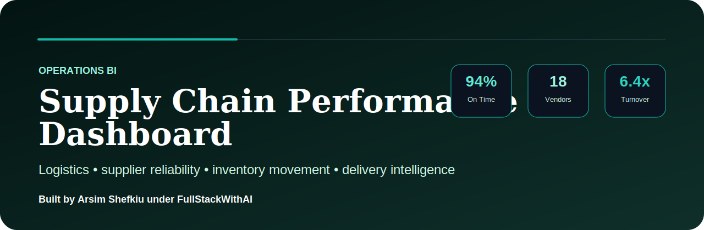

# Supply Chain Performance Dashboard

> Operations BI dashboard for logistics performance, supplier reliability, delivery speed, inventory movement, and supply-chain risk visibility.

Built by **Arsim Shefkiu** under **FullStackWithAI**.

[www.designhubmk.com](https://www.designhubmk.com) · arsim@designhubmk.com · [GitHub: fullstackwithai](https://github.com/fullstackwithai)

---

## Operations BI Theme

> **Logistics data to operational clarity. Supplier signals to risk control.**

This repository is presented as a premium supply-chain analytics dashboard for tracking shipment performance, supplier reliability, inventory movement, and delivery risk.

| Theme Layer | Direction |
|---|---|
| **Design Identity** | Teal, slate, and logistics operations palette |
| **Product Feel** | Supply-chain command center / operations BI dashboard |
| **Audience** | Operations leaders, logistics teams, analysts, BI hiring managers |
| **Core Message** | Delivery data + supplier performance + inventory movement + risk visibility |

---

## Operations KPI Layer

| KPI | Purpose |
|---|---|
| **On-Time Delivery Rate** | Measures delivery reliability |
| **Supplier Score** | Tracks vendor performance |
| **Inventory Turnover** | Shows how efficiently stock moves |
| **Late Shipments** | Identifies logistics bottlenecks |
| **Risk Exposure** | Highlights operational weak points |

---

## Business Questions

| Question | Why It Matters |
|---|---|
| **Which suppliers are underperforming?** | Supports vendor accountability |
| **Where are delivery delays increasing?** | Helps reduce customer and operational impact |
| **Which inventory categories move fastest?** | Improves stock planning |
| **Where are supply-chain risks concentrated?** | Helps prioritize operational fixes |

---

## What This Project Demonstrates

| Capability | Evidence in This Repo |
|---|---|
| **Operations Analytics** | Delivery, supplier, inventory, and logistics KPIs |
| **Supply Chain BI** | Performance tracking across operational workflows |
| **Dashboard Strategy** | Risk and reliability signals structured for leadership |
| **Data Storytelling** | Turns logistics data into operational recommendations |
| **Portfolio Positioning** | Strong DA/BI project for operations and analytics roles |

---

## Suggested Project Architecture

```text
supply-chain-performance-dashboard/
├── assets/
│   └── readme-hero.svg
├── data/
│   └── supply-chain-sample.csv
├── sql/
│   └── logistics-performance-analysis.sql
├── dashboard/
│   ├── index.html
│   ├── styles.css
│   └── app.js
├── insights/
│   └── operations-summary.md
└── README.md
```

---

## Creator & Brand

### Built by **Arsim Shefkiu** under **FullStackWithAI**

> **Supply-chain BI theme focused on logistics performance, supplier reliability, delivery risk, and operational clarity.**

| Creator Focus | Brand Positioning |
|---|---|
| I build operations dashboards that turn logistics activity into clearer performance and risk decisions. | **FullStackWithAI** represents premium portfolio work around practical data problems, polished dashboards, and AI-assisted execution. |

**Theme:** Supply Chain BI · Logistics Analytics · Supplier Reliability · Operations Intelligence

[www.designhubmk.com](https://www.designhubmk.com) · arsim@designhubmk.com · [GitHub: fullstackwithai](https://github.com/fullstackwithai)
